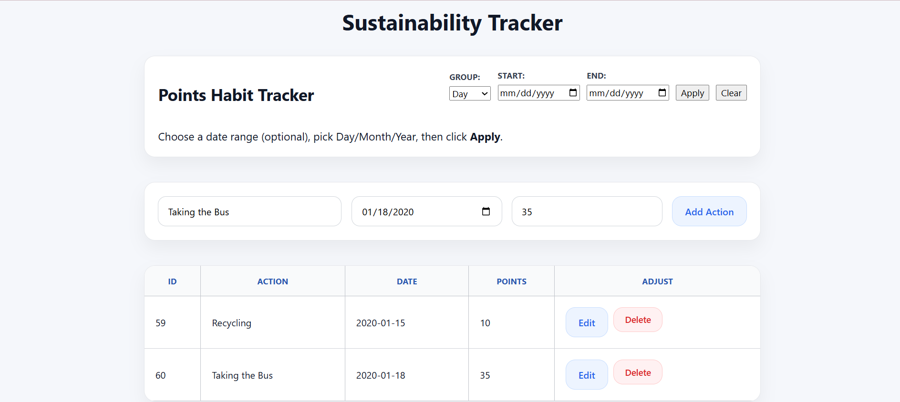
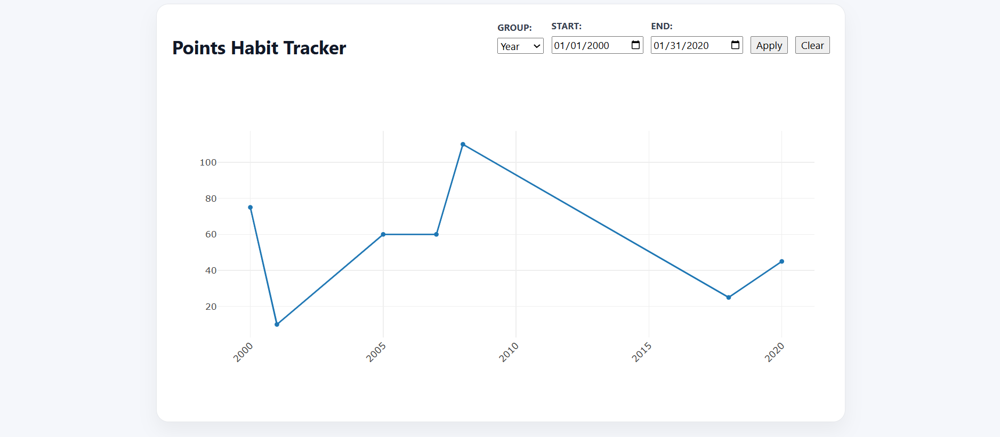

# Sustainability Tracker

A full-stack web application for tracking sustainability actions using a Django REST API and a React frontend. Users can log sustainability actions, assign point values, edit or delete entries, and visualize their progress over time using an interactive chart.

---

## Project Objective

The goal of this project is to build a RESTful API using Django and Django REST Framework to manage sustainability actions. The API supports creating, retrieving, updating, and deleting actions. A React frontend is used to interact with the API and display the data.

---

## Core Features: CRUD operations

- Create, view, edit, and delete sustainability actions
- Display all actions in an interactive table with inline editing option
- RESTful Django API that returns structured JSON responses
- React frontend integrates with the backend using Axios for data fetching and updates



## Additional Features: Interactive Point Visualization 
Beyond the core CRUD requirements, I focused on how users might interact with this application over time and what features would help them stay motivated in making sustainable choices. From personal experience, being able to see progress visually plays a key role in building and maintaining habits. Therefore, I wanted to build a progress-tracking feature that allows users to reflect on their efforts.


### Interactive Points Line Chart
To support this, I implemented an interactive line chart that visualizes sustainability points over time. Key capabilities include being able to: 
- Custom Date Ranges: Users can select a start and end date to focus on specific periods
- Flexible time aggregation: View total points grouped by day, month, or year, depending on the level of detail the user wants
- Interactive: Built using Plotly



---

## Tech Stack

- Backend: Python, Django, Django REST Framework
- Frontend: React, Axios, Plotly (`react-plotly.js`, `plotly.js`)

More details in the Prerequisites section below

---

## API Endpoints

| Method | Endpoint | Description |
|------|--------|------------|
| GET | `/api/actions/` | Retrieve all sustainability actions |
| POST | `/api/actions/create/` | Create a new action |
| PUT | `/api/actions/<id>/` | Update an existing action |
| DELETE | `/api/actions/<id>/` | Delete an action |
| GET | `/api/actions/points-timeseries/` | Retrieve total points over a given time period (by day, month, or year) |

### Sample POST Payload

```json
{
  "action": "Recycling",
  "date": "2025-01-08",
  "points": 25
}
```
---

## Prerequisites

Before running this project, ensure the following are installed on your system:

- Python 3.x
- pip
- Node.js
- Yarn
- Git

### Verify Python and pip Installation

Run the following commands in your terminal:
```bash
python --version
pip --version
```

---

## Backend Setup (Django)

The backend is built using Django and Django REST Framework and provides a RESTful API for managing sustainability actions.

### Step 1: Navigate to the Backend Directory
```bash
cd SustainabilityTracker/server
```

### Step 2: Install Backend Dependencies
```bash
pip install django djangorestframework
```

### Step 3: Navigate to the Django Project Directory
The Django manage.py file is located inside the newproject folder. Navigate there:
```bash
cd newproject
```

### Step 4: Run the Django Development Server
```bash
python manage.py runserver
```


If successful, you should see:
```text
Starting development server at http://127.0.0.1:8000/
```

### Backend URL

The backend API will be available at:
```
http://127.0.0.1:8000/
```

---

## Step 1: Frontend Setup (React)

The frontend is built using React and Vite and communicates with the backend API to display and manage sustainability actions.

### Step 2: Navigate to the Frontend Directory
```bash
cd SustainabilityTracker/client/app
```

### Step 3: Install Frontend Dependencies
```bash
yarn add axios
yarn add react-plotly.js plotly.js
```

### Step 4: Run the Frontend Development Server
```bash
yarn dev
```

If successful, you should see:
```text
Local: http://localhost:5173/
```

### Frontend URL

The frontend application will be available at:
```
http://localhost:5173/
```

---
## Testing
- Backend Testing: API endpoints were tested using Postman
- Frontend Testing: functionality was tested manually in the browser

---
### Sample Images


